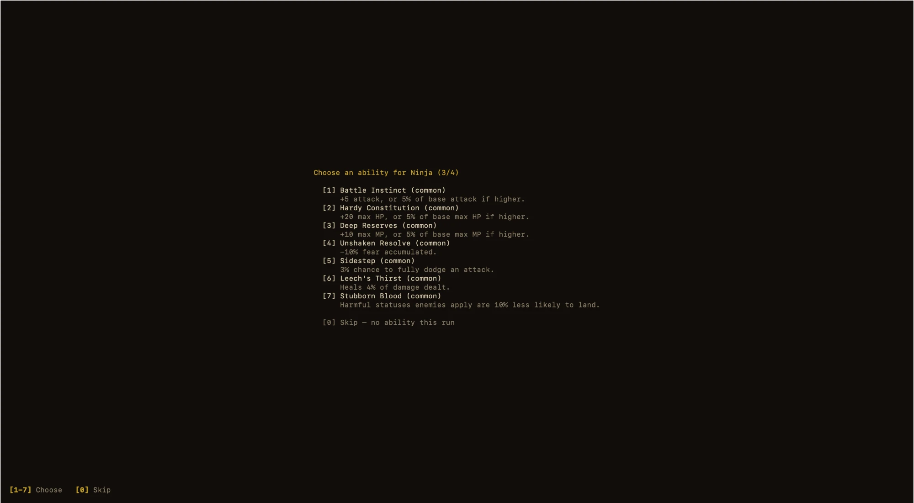

# Darkest Terminal

```
   █████   ████  █████  ██  ██ ██████  █████ ██████
   ██  ██ ██  ██ ██  ██ ██ ██  ██     ██       ██
   ██  ██ ██████ █████  ████   █████   ████    ██
   ██  ██ ██  ██ ██ ██  ██ ██  ██         ██   ██
   █████  ██  ██ ██  ██ ██  ██ ██████ █████    ██

██████ ██████ █████  ██    ██ ██ ██    ██  ████  ██
  ██   ██     ██  ██ ███  ███ ██ ███   ██ ██  ██ ██
  ██   █████  █████  ██ ██ ██ ██ ██ ██ ██ ██████ ██
  ██   ██     ██ ██  ██    ██ ██ ██   ███ ██  ██ ██
  ██   ██████ ██  ██ ██    ██ ██ ██    ██ ██  ██ ██████
```

*A dungeon doesn't care that your only monitor is a terminal window.*

[](https://github.com/Nhat-TheDev/DarkestTerminal/actions/workflows/darkest-terminal-test.yml)
[](https://github.com/Nhat-TheDev/DarkestTerminal/actions/workflows/verify-build.yml)
[](https://www.npmjs.com/package/darkest-terminal)
[](./LICENSE)


## 📖 Introduction

**Darkest Terminal** is a roguelike dungeon crawler that runs entirely in your
terminal — no graphics card, no window manager, just you, a keyboard, and a
dungeon that goes as deep as you dare.

Pick 4 characters from a roster of 9 classes and lead them down an endless,
procedurally generated dungeon. Every floor is freshly built, every branch
eventually leads back to a guarded boss room, and every fight is turn-based —
command your whole party, then watch the round play out in speed order. There
is no "you win" screen: you play until your party falls, permanently. Manage
hunger and fear alongside HP and MP, gear up on items and permanent
Artifacts, spend the coin you loot on gambles and favors from strange
wanderers, and see how far down you can get.


## 🚀 Installation

The easiest way — no installation required, works on macOS and Windows
(downloads a self-contained binary the first time you run it):

```bash
npx darkest-terminal
```

Running from source (needs [Bun](https://bun.sh)):

```bash
bun install
bun run start
```

## 🎮 How to Play

**Starting up.** You'll first see the title (splash) screen — press any key
to reach the menu, then choose **New Game** or **Continue** (Continue only
shows up once you have a save). New Game takes you straight to the character
select screen.

**Building your party.** Pick exactly 4 characters from the 9-class roster —
number keys to select/deselect a class, any key to confirm once you have 4.
Each class plays differently, so a mix of roles (a tank, some damage, some
support) will serve you better than four of the same idea.


**Picking abilities.** Right after character select, each character gets one
ability pick from the persistent pool you've unlocked so far (or skip) —
these carry over between runs, unlike anything else tied to a save.



**Controls.** Everything in the game is driven by a **number** key — moving
between rooms, choosing skills/items, picking targets, rest-room choices,
event choices. After a round of combat resolves, the log plays back what
happened one line at a time (press any key to skip straight to the end),
then press any key again to move on. Use **↑/↓** to scroll back through the
combat log, and **q** to quit.


**The loop.** Move from room to room, fight whatever's guarding the way,
collect coins/items/Artifacts, and keep your party's Fear and Satiety in
check between fights. Clear the guarded room at the end of a floor and the
next floor generates immediately — there's no final boss to "beat the game,"
just how deep you can push before your party doesn't make it back.

## ✨ Features

- **An endless, hand-crafted-feeling dungeon** — no two runs look the same,
  and there's no scripted ending. You play until you can't.
- **9 classes, a party of 4** — Vanguard, Mage, Rogue, Acolyte, Viking, Plague
  Doctor, Archer, Ninja, and Summoner. Each plays differently.
- **Turn-based tactical combat** — command your party, then watch the round
  play out.
- **A real bestiary** — dozens of monsters, plus dedicated Elite/Boss guards
  waiting at the end of every floor.
- **Fear & Satiety** — two survival stats running alongside HP/MP, and they
  will turn on you if you're not careful.
- **True permadeath.** No mid-run resurrections.
- **Leveling 1-100** — grow your party as you descend.
- **Items & permanent Artifacts** — gear up, and make some hard calls about
  what to keep.

  

- **Cursed Coins** — a currency to spend, gamble, or trade away.
- **Event rooms with real narrative** — random encounters, some of them tied
  to faces you'll see again.
- **Save & continue** — pick up a run later from a list of your saves.
- **Pixel art rendered directly in the terminal** — every character and
  monster is hand-drawn pixel art, composited straight into your terminal
  window as colored character cells.

## 📚 For developers

The rest of this README used to live here — it now lives in
**[`docs/developer-guide.md`](./docs/developer-guide.md)**, which serves as
the entry point for understanding how the game is built: architecture, data
files, code layout, and how to run the test suite.
