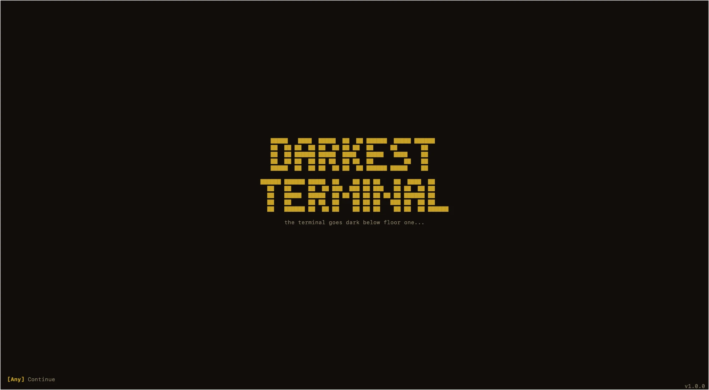
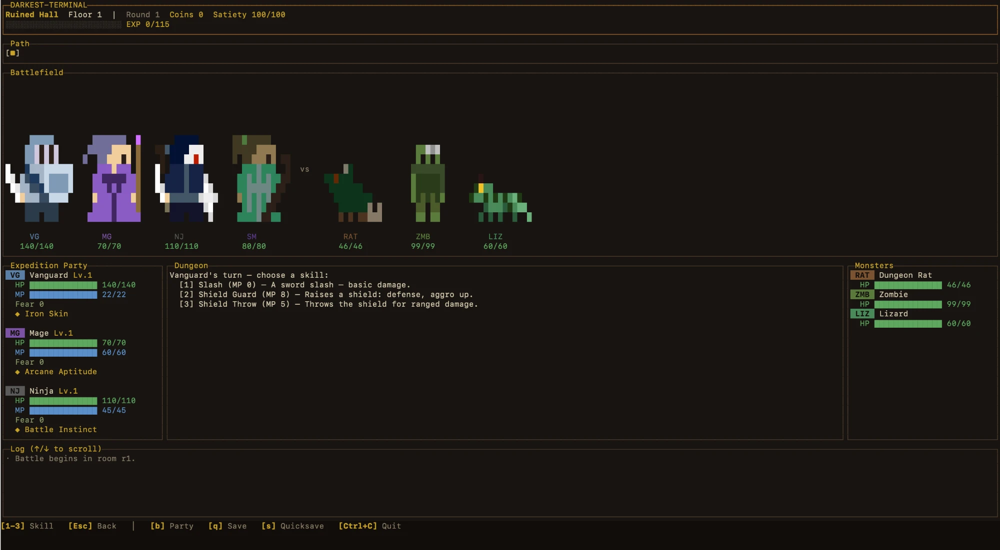
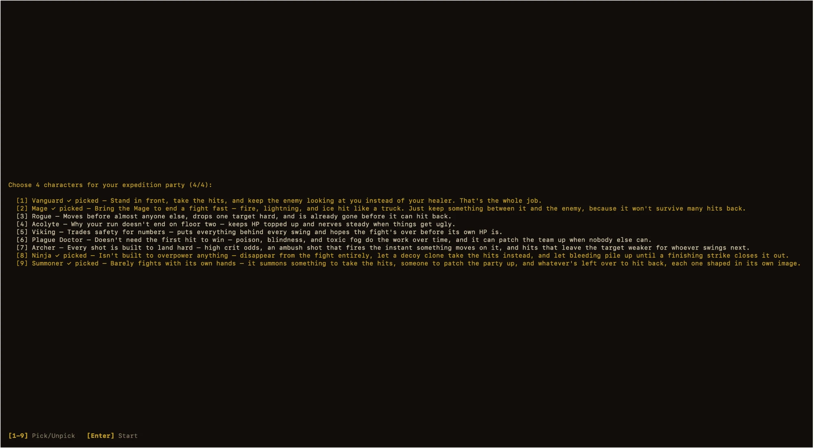
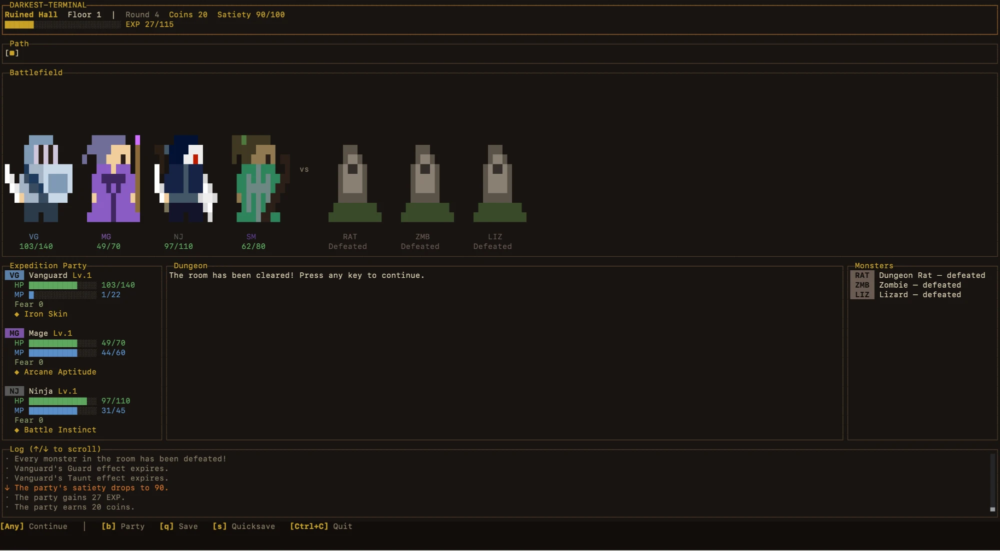
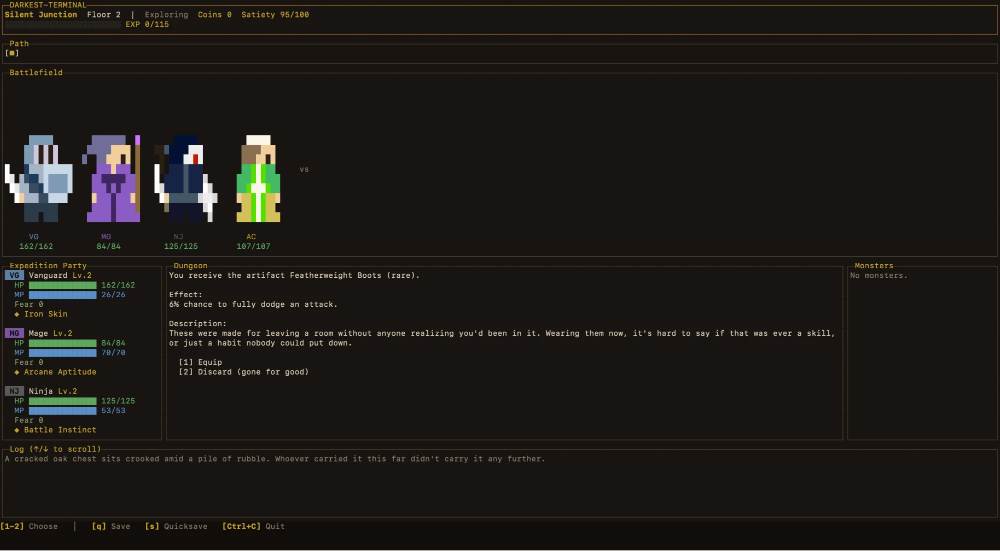

# Darkest Terminal

```
   █████   ████  █████  ██  ██ ██████  █████ ██████
   ██  ██ ██  ██ ██  ██ ██ ██  ██     ██       ██
   ██  ██ ██████ █████  ████   █████   ████    ██
   ██  ██ ██  ██ ██ ██  ██ ██  ██         ██   ██
   █████  ██  ██ ██  ██ ██  ██ ██████ █████    ██

██████ ██████ █████  ██    ██ ██ ██    ██  ████  ██
  ██   ██     ██  ██ ███  ███ ██ ███   ██ ██  ██ ██
  ██   █████  █████  ██ ██ ██ ██ ██ ██ ██ ██████ ██
  ██   ██     ██ ██  ██    ██ ██ ██   ███ ██  ██ ██
  ██   ██████ ██  ██ ██    ██ ██ ██    ██ ██  ██ ██████
```

*A dungeon doesn't care that your only monitor is a terminal window.*

[](https://github.com/Nhat-TheDev/DarkestTerminal/actions/workflows/darkest-terminal-test.yml)
[](https://github.com/Nhat-TheDev/DarkestTerminal/actions/workflows/verify-build.yml)
[](https://www.npmjs.com/package/darkest-terminal)
[](./LICENSE)


A terminal roguelike dungeon crawler, matching the design described in
`./docs/design-doc.md` and `./docs/*.md`: a multi-floor dungeon randomly
generated by a floor-generation algorithm, descending a floor each time you
defeat the monster guarding the final room, a party of 4 characters (chosen
from 4 classes), a variety of regular monsters plus elites/bosses, 2-phase
combat rounds (command + speed-ordered execution), and
items/artifacts/currency/event rooms. Runs on [Bun](https://bun.sh) +
[OpenTUI](https://github.com/anomalyco/opentui).




## 🚀 Try it out

Contributing / running from source (needs [Bun](https://bun.sh)):

```bash
bun install
bun run start
```

Once published to npm, players on macOS or Windows will be able to run the
game via a self-contained binary (embeds the Bun runtime) without installing
Bun or Node build tooling themselves:

```bash
npx darkest-terminal
```

You'll first see the title (splash) screen — press any key to reach the menu,
**New Game** / **Continue** (only shown once a save exists). New Game → pick
4 classes for your party (number keys to select/deselect, any key to confirm
once you have 4).



In-game controls: press a **number** to select (moving between rooms /
skills / items / targets / rest room choices / events), press any key to
continue after a round ends, **↑/↓** to scroll the combat log, **q** to quit.

## 🧪 Tests

```bash
bun test        # unit tests for the engine (resolver, combat, aggro, level, floor pattern, ...) +
                 # headless smoke tests for the UI (simulated keyboard input via @opentui/core/testing)
bun run typecheck
bun run sprite-editor  # dev tool: edit pixel-art sprites in the browser (tools/sprite-editor/)
bun run rebalance-editor  # dev tool: inspect/compare character & monster stats, damage, and level-by-depth projections (tools/rebalance-editor/)
```

## ✅ What's implemented

- **Multiple dungeon floors, with real floor descents** — each floor is generated by a runtime algorithm (see "Floor structure" below), always with 1 entrance and 1 guard room (elite/boss) at the end, no dead ends, every branch converging back to the boss. Defeating the monster guarding the final room of a floor → immediately generates the next floor — there's no fixed "you win the game" state, you just play as far as you can get — `src/data/floor.ts`, `src/data/floorPatterns.ts`, `src/engine/game.ts`
- **4 classes** with 6 stats + a basic attack (slot 0, free) + class-specific skills in slots 1-2 (Vanguard, Mage, Rogue, Acolyte) — `src/data/classes.ts`
- **Character selection at game start + save/load** — a party of 4 characters manually chosen from the 4 classes on the character select screen; save/continue via a list of saves — `src/ui/characterSelect.ts`, `src/ui/saveSelect.ts`, `src/engine/save.ts`
- **11 regular monster types** + **5 guard-room archetypes** (shared Skeleton Guard, plus dedicated elite/boss ones) guarding the boss room of every floor, with 1 of the 5 picked at random each time — `src/data/monsters.ts`
- **2-phase combat** (command all 4 characters → execute in speed order, monsters decide on the spot), `aggro`-based targeting (weighted random), retarget/cancel rule when a target dies before its turn — `src/engine/combat.ts`
- **Dedicated Elite/Boss skill kit** (all 5 guard-room archetypes): a single-target strike + an AoE cleave for both tiers; the Boss additionally gets its own archetype-specific debuff and a charge-then-unleash mechanic for a very high fixed-damage attack (Finishing Blow) — `data/monster-skills.json`, `src/engine/combat.ts`
- **`SkillEffect` resolver** shared across skills/status-effects/items, buffs/debuffs via `modifyCombatStat`, DoT ticks at the end of every round — `src/engine/resolver.ts`
- **Fear + Satiety survival stats**, HP=0 → true permadeath, fear affects combat back through 4 tiers — `src/engine/survival.ts`, `src/engine/resolver.ts`. Satiety is party-wide, draining once per room resolved (amount depends on room type); low satiety escalates through **Exhausted** (stats reduced) and **Dying** (a recurring HP tick on top of Exhausted). The rest room offers 3 recovery choices, and **Camp** — a post-victory option paid for with an Exploration Kit item — restores satiety outside the rest room. Details in [`docs/gameplay-decisions/03-survival-stats.md`](./docs/gameplay-decisions/03-survival-stats.md)
- **Level 1-100 system**: `attack`/`defense`/`maxHp`/`maxMp` grow through tapered tiers via `growthBonus()`, shared between characters (by `level`) and monsters (by `floorDepth`). Characters additionally apply their own class-specific `growthWeights` so the 4 classes don't converge to look the same at high levels. Character level (shared across the party, capped at 100, gained through EXP from killing monsters) is completely separate from dungeon floor level (`Floor.depth`, uncapped) — details in [`docs/gameplay-decisions/06-level-system.md`](./docs/gameplay-decisions/06-level-system.md)
- **Consumable items + permanent, one-shot-decision Artifacts** — items dropped by monsters, usable in/out of combat unless flagged combat-only-off; artifacts are equipped on one specific character (max 3 per character) the instant they're picked up — the player decides equip-or-discard right then, with no free reassignment afterward (3 narrow exceptions) — effects only counting for whoever has it equipped — `src/data/items.ts`, `src/data/artifacts.ts`, `src/engine/artifacts.ts`, `src/engine/party.ts`, details in [`docs/gameplay-decisions/07-items-artifacts.md`](./docs/gameplay-decisions/07-items-artifacts.md)
- **Cursed Coins** — a party-wide currency dropped by every monster kill (amount by monster power tier), spent in the Merchant (coin prices + a paid Refresh), the Wandering Gambling Den (a 4-round escalating coin gamble), and the Wandering Hermit's Exchange Fortune service — `src/data/currency.ts`, `src/engine/events/`, details in [`docs/gameplay-decisions/09-currency.md`](./docs/gameplay-decisions/09-currency.md)
- **Event room** — a random event room rolling 1 of several event types when entered, split into 2 rarity tiers — `src/data/events.ts`, details in [`docs/gameplay-decisions/08-events.md`](./docs/gameplay-decisions/08-events.md)





- **Title (splash) screen** before entering the game — built with a hand-written block font (`src/ui/bigText.ts`, `test/bigText.test.ts`) — `src/ui/mainMenu.ts`, `src/main.ts`

## ✂️ Cut from scope (compared to the full design doc)

Not yet implemented: **4 mini-games** (Snake/Tetris/Brick Breaker/Magic Tiles — debuffs currently only expire via `durationTurns`, and bosses have no mini-game phase) and **FOV/pathfinding/diff-based rendering**. See the "Future direction" section in [`docs/design-doc.md`](./docs/design-doc.md) for the full spec of these parts.

## 📦 Design data (JSON)

All numeric/content data for characters, monsters, effects, items,
artifacts, events, pixel-art sprites, and UI text lives in `data/*.json`
(not TypeScript) — tweaking numbers or adding new content doesn't require
touching code, just editing the JSON to match the right shape. The modules
in `src/data/`/`src/ui/sprites.ts` are just a thin loading + light-validation
layer that re-exposes an API (`getClass`, `getSkill`, `getArchetype`,
`getItem`, `getArtifact`, `getEvent`, `spriteForClass`, `t`, ...) — the rest
of the code doesn't need to know the data comes from JSON.

| File | Contents | Loader |
|---|---|---|
| `data/classes.json` | 4 classes (Vanguard/Mage/Rogue/Acolyte): stats + all 6 skills per class | `src/data/classes.ts` |
| `data/monsters.json` | 15 monster archetypes (11 regular combat + 5 guard-room): base stats + AI pattern + `guardOnly` flag | `src/data/monsters.ts` |
| `data/monster-skills.json` | Elite/Boss-specific skills (strike/cleave/execute/debuff × 5 guard-room archetypes) | `src/data/monsters.ts` |
| `data/status-effects.json` | Buffs/debuffs (`guard`, `taunt`, `rally`, `poison-coat`, `poisoned`, `burning`, `stunned`, `weakened`, ...) | `src/data/statusEffects.ts` |
| `data/items.json` | Consumable items (shared items + archetype-specific items, incl. the combat-unusable Exploration Kit) | `src/data/items.ts` |
| `data/artifacts.json` | Equippable artifacts (multiple rarity tiers, multiple effect types, incl. Cursed ones) | `src/data/artifacts.ts` |
| `data/events.json` | Events for the event room (2 rarity tiers) | `src/data/events.ts` |
| `data/level-growth.json` | Stat growth tiers by level/depth + elite/boss coefficients + `expTiers` | `src/data/levelGrowth.ts` |
| `data/balance-config.json` | Shared balancing constants (drop rates, weights, thresholds, Cursed Coin amounts...) | `src/data/balanceConfig.ts` |
| `data/sprites.json` | Pixel-art (character grid + palette) for the 4 classes + every monster archetype, with dedicated elite/boss variants for the guard-room archetypes | `src/ui/sprites.ts` |
| `data/strings.json` | All text displayed in the UI | `src/data/strings.ts` |

## 🗺️ Floor structure — generated at runtime

Floors are generated directly by a runtime algorithm (`generateFloorLayout`,
`src/data/floorPatterns.ts`). The structure is based on the concept of a
**stage** (column): **every room in stage N connects to every room in stage
N+1**, with no other edges allowed. There are no dead ends, and every branch
converges back to the boss.

Stage 0 is always the entrance (1 room), and the final stage is always the
boss room (1 room). Branch points insert 1 combat room + 1 event room side by
side; rest rooms are scattered randomly across the remaining stages. The
detailed rules (min/max room counts, number of branch points, spacing between
branch points, ...) and invariants are covered by a property-based test:
**[`docs/technical-decisions.md`](./docs/technical-decisions.md)** §1.

Room names, and the monster types/counts for each combat room, are
randomized in `src/data/floor.ts` when the layout is built into an actual
`Floor` (reused for every floor, with `depth` increasing via
`Game.advanceToNextFloor()`) — the layout only determines the
**structure**, not the content of individual rooms.

## 🖥️ Interface

Before entering the game: title screen (`src/ui/mainMenu.ts`) → character
select (`src/ui/characterSelect.ts`) or save select (`src/ui/saveSelect.ts`).
In-game: a dark color theme (background `#100d0a`/panel `#171310`), with each
character/monster getting its own colored "chip" (a colored background chip +
abbreviation, e.g. `VG` in steel blue for Vanguard, `GRD` in bone gray for
Skeleton Guard, bosses tinted red). HP changes color by threshold
(green/yellow/red), and fear only shows a colored label from tier 2 onward.

### The "Battlefield" panel — pixel art

A dedicated panel right under the header, showing the party of 4 characters
(left) and the monsters/boss in the current room (right), rendered as pixel
art: **1 pixel = 1 character cell** (a space with a background color, no
visible glyph). Characters/regular monsters are up to **10 pixels** tall,
elites up to **11 pixels**, bosses up to **13 pixels** (`MAX_UNIT_HEIGHT`/
`MAX_ELITE_HEIGHT`/`MAX_BOSS_HEIGHT`, `src/ui/sprites.ts`) — every unit is
rendered into the same fixed-width slot (`SLOT_WIDTH`, `src/ui/app.ts`) and
bottom-aligned within a shared 13-pixel-tall frame. Below each sprite are 2 lines
of text (abbreviation + current HP) — full detail (long names, MP, effects...)
lives in the "Expedition"/"Monsters" panels below. Sprite data lives in
`src/ui/sprites.ts`, with its own tests (`test/sprites.test.ts`) that catch
row/column misalignment or missing palette colors. Sprites are edited
visually in the browser via `bun run sprite-editor` (`tools/sprite-editor/`)
rather than by hand-editing the character grid in JSON.

This panel needs quite a bit of vertical space (13 pixels + 3 label lines +
border ≈ 18 lines), plus the other panels → so a terminal **at least ~45-50
lines tall** is recommended; a shorter terminal will clip the bottom of the
frame (labels/HP).

The remaining panels:
- **Expedition**: each character is trimmed down to 2 lines (name+chip, HP/MP/fear);
  a name-line tag appears when the party is Exhausted/Dying (satiety-driven,
  party-wide — `docs/gameplay-decisions/03-survival-stats.md` §3), and a 3rd
  line appears for an active status effect or equipped artifact. Party-wide
  Coins/Satiety are shown in the header instead of per character.
- **Monsters**: the list of monsters currently in combat + their HP, hidden
  when there are no monsters in the room
- **Log**: 8 lines tall, **scrollable** (`↑`/`↓`, `ScrollBoxRenderable`,
  sticks to the bottom by default) — keeps the entire log history for the run

The full theme/color palette is defined in `src/ui/theme.ts` — to change the
color scheme or add a new class/monster, edit `PALETTE`/`CLASS_STYLE`/
`MONSTER_STYLE` there (and add the matching sprite in `src/ui/sprites.ts`).

## 📁 Code structure

```
data/                  # design data as JSON — see "Design data" above
  classes.json
  monsters.json
  monster-skills.json
  status-effects.json
  items.json
  artifacts.json
  events.json
  level-growth.json
  balance-config.json
  sprites.json
  strings.json
src/
  types.ts            # runtime types, cross-referenced against ./dungeon-crawler-data-model.ts
  data/                # loaders for data/*.json + build logic (spawnMonster, floor layout generation, ...)
    classes.ts          # data/classes.json loader — getClass, getSkill
    monsters.ts          # data/monsters.json + data/monster-skills.json loader — spawnMonster, getArchetype, getMonsterSkill
    statusEffects.ts     # data/status-effects.json loader — getStatusEffect
    items.ts             # data/items.json loader — getItem, rollItemDrop
    artifacts.ts         # data/artifacts.json loader — getArtifact, rollArtifact/rollArtifactWithMinRarity (rarity weights are a module-private const, not exported)
    events.ts            # data/events.json loader — getEvent, rollEvent
    floor.ts             # createFloor(rng, depth) — builds a Floor from a generated layout + spawns rooms/monsters
    floorPatterns.ts     # generateFloorLayout(rng) — generates floor structure at runtime
    levelGrowth.ts        # growthBonus(stat, level)/growthBonusForDepth by tier + elite/boss coefficients + expTiers
    balanceConfig.ts      # shared balancing constants, read from data/balance-config.json
    currency.ts            # rollCoinDrop(monster, rng) — Cursed Coin amounts by monster power tier
    strings.ts            # UI text loader from data/strings.json
  engine/              # pure logic (rng, party, resolver, combat, survival, dungeon, artifacts, save, migration, game) — testable without the UI
    party.ts             # character creation/stats, the Artifact equip/discard/replace decision flow (grantArtifact, resolveArtifactEquip, discardPendingArtifact)
    survival.ts           # fear + satiety mechanics: room-entry drain, Exhausted/Dying, Camp, rest room actions
    migration.ts           # upgrades a GameState loaded from an older save to the current shape (see save.ts)
    events/               # 1 file per event room (merchant, bloodAltar, cursedShrine, twinAltars, sacrifice, gamblingDen, hermit, collapsedFloor)
  ui/theme.ts          # color palette + StyledText helpers (chips, HP/fear-based coloring)
  ui/sprites.ts        # loads pixel-art sprites from JSON + renders them into a fixed frame
  ui/bigText.ts        # hand-written block font for the title screen
  ui/mainMenu.ts        # title screen, waits for any key before booting the App
  ui/characterSelect.ts # picking 4 classes for the party at the start of a new game
  ui/saveSelect.ts      # picking a save to continue
  ui/app.ts            # OpenTUI: layout + keyboard input, only reads/writes through Game
  ui/screens/           # 1 module per screen (room, combat, artifacts, artifactDecision, camp, events, rewards, inventory, save, gameover) — handleKey/renderMain/renderFooter
  main.ts              # actual entry point (createCliRenderer → mainMenu → characterSelect/saveSelect → App)
tools/
  sprite-editor/        # dev tool: edit pixel-art sprites in the browser (bun run sprite-editor)
  rebalance-editor/     # dev tool: inspect/compare character & monster stats, damage, and level-by-depth projections (bun run rebalance-editor)
test/
  engine.test.ts       # engine unit tests, including one full-playthrough scenario
  ui.test.ts           # headless smoke test: boot + play a full run via simulated keyboard input, incl. a regression test for the post-victory artifact-decision/floor-advance ordering
  artifact-effects.test.ts # the Artifact equip/discard/replace decision flow, effect hooks, Exhausted stat math, fear-relief quick-win rules
  events.test.ts       # every event room's mechanics, incl. Merchant Refresh and the Gambling Den's 4-round coin state machine
  survival-currency.test.ts # Camp, coin-drop ranges by monster power tier, save-file migration from a pre-rework save
  sprites.test.ts      # per-sprite dimensions/palette + renderSpriteInSlot behavior
  bigText.test.ts      # block font: every glyph has consistent width per row
  floorPatterns.test.ts # property-based test for generateFloorLayout: branching rules, reachability, validator
  levelGrowth.test.ts  # 1-100 milestone table matches the docs, regression test for the "near-immortal" elite boss bug
```
